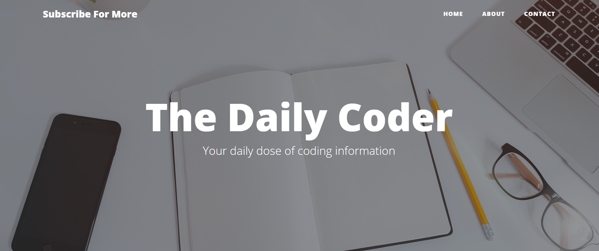

# The Daily Coder
Blogging app with complete functionality of adding, viewing, making changes, and deleting your blogs, made with Flask Framework.The app comprises complete login functionality 
and dashboard feature where only the author/admin will be able to make changes to blogs. Also, it comes with an additional feature where viewers can send their messages 
to the author which the author will receive as mail.

# Preview

# Tech Stack Used
Web Framework - Flask
 
Database - SQLAlchemy
 
Used <b>PhpMyAdmin</b> for managing the database.

# Installation
Clone the repository
 
Install the necessary modules as mentioned in requirements.txt file.
 
Modify the <b>config.json</b> file.
 
Create a new SQL database using phpMyAdmin and import the sql file present in the repository.

